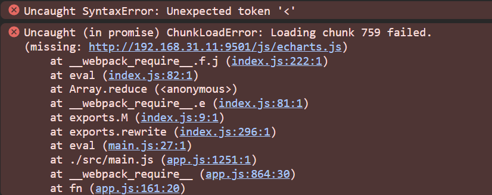
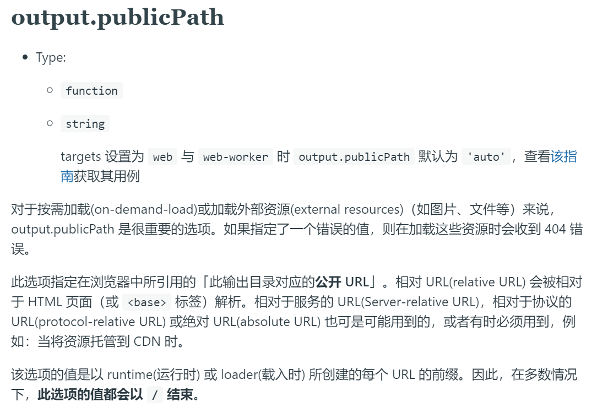
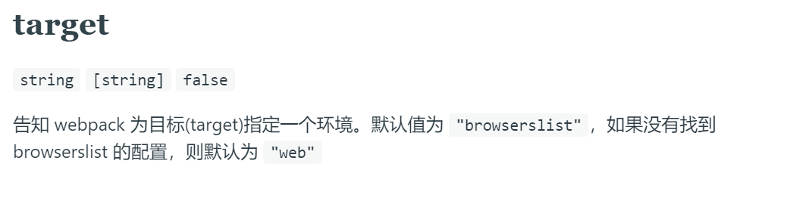

webpack 动态引入
-
最近在写一个公用库时，遇到一个需求：

在某个初始化函数内需要根据传参来确实初始化哪一种图表，而两种界面用到的第三方库不同

如果将两个库都引入，然后根据条件判断去执行对应库里的函数，就会造成明明只想要 A 图表，却将 B 图表需要的第三方库也打包进去

并且由于是条件判断，因此无法做树摇（`webpack` 只分析代码，不执行代码），无论如何分包，两个库都会被打包进去

于是想到，通过动态引入另外两种工具库：
```javascript
exports.init = echarts => {
    if (echarts) {
        import('echarts'/* webpackChunkName: "echarts" */).then(res => {
            console.log(res)
        })
    } else {
        import('@antv/g2'/* webpackChunkName: "ant" */).then(res => {
            console.log(res)
        })
    }
}
```

代码写完以后打包，发布到 `npm`，紧接着在工程内引入使用:
```javascript
import { init } from 'tools'
init(true)
```

结果发现报错了，`echarts.js` 引入失败：


然后一看链接路径，`js` 文件夹下确实没有这个文件

因为在打包我自己的 `tools` 时，`webpack` 将 `echarts` 单独分出来了

但是在工程中动态使用，请求的路径不对，所以导致 `404`

webpack 动态引入实现原理
-
那么我们看一下 `webpack` 是如何得到这个路径的（部分代码已省略，仅展示与获取路径相关代码）：
```javascript
/* 重点在于得出 __webpack_require__.p */
/* webpack/runtime/publicPath */
(() => {
    // ...省略部分代码
    var scripts = document.getElementsByTagName("script");
    /*  从后往前，获取一个 src   */
    if(scripts.length) {
        var i = scripts.length - 1;
        while (i > -1 && !scriptUrl) scriptUrl = scripts[i--].src;
    }
    // ...省略部分代码
    if (!scriptUrl) throw new Error("Automatic publicPath is not supported in this browser");
    scriptUrl = scriptUrl.replace(/#.*$/, "").replace(/\?.*$/, "").replace(/\/[^\/]+$/, "/");
    /* 通过正则，剔除哈希，剔除问号参数拼接，剔除文件名，最终得到前缀路径，并赋值给 __webpack_require__.p */
    __webpack_require__.p = scriptUrl;
})();
/*
* 重点在于定义 __webpack_require__.l 这个函数
* 该函数传入完整的 url、chunkId 以及其它参数
* 被 __webpack_require__.f.j 函数调用
* */
/* webpack/runtime/load script */
(() => {
    __webpack_require__.l = (url, done, key, chunkId) => {
        // ...省略部分代码
        var script = {}
        // ...省略部分代码
        script.src = url;
        // ...省略部分代码
        script.onerror = onScriptComplete.bind(null, script.onerror);
        script.onload = onScriptComplete.bind(null, script.onload);
        // ...省略部分代码
        document.head.appendChild(script);
    };
})();
/*
* 重点在于 __webpack_require__.f.j 这个函数
* 将第一步中得到的 __webpack_require__.p 和 chunk 组合得到完整的 url
* 然后调用 __webpack_require__.l 函数加载动态引入的库
* */
/* webpack/runtime/jsonp chunk loading */
(() => {
    __webpack_require__.f.j = (chunkId, promises) => {
        // ...省略部分代码
        // 组装 URL
        var url = __webpack_require__.p + __webpack_require__.u(chunkId);
        // ...省略部分代码
        var error = new Error();
        var loadingEnded = (event) => {
            if(__webpack_require__.o(installedChunks, chunkId)) {
                // ...省略部分代码
                // 之前的报错就是在这里抛出的
                var errorType = event && (event.type === 'load' ? 'missing' : event.type);
                var realSrc = event && event.target && event.target.src;
                error.message = 'Loading chunk ' + chunkId + ' failed.\n(' + errorType + ': ' + realSrc + ')';
                error.name = 'ChunkLoadError';
                error.type = errorType;
                error.request = realSrc;
                installedChunkData[1](error);
            }
        };
        __webpack_require__.l(url, loadingEnded, "chunk-" + chunkId, chunkId);
    };
})();
```

可以看出，动态加载大致的步骤：
* 通过 `chunkId` 得到单独分包的那个库的文件名 
* 通过最后一个有效的 `script` 上的 `src` 属性和正则获取前缀路径
* 将前缀路径和要加载的文件名拼接，调用相关函数加载脚本

而 `404` 的原因就是出在获取 `__webpack_require__.p` 这个过程

由于默认它是去读取当前项目其它 `js` 的请求路径，然后作为 `echarts.js` 的前缀路径

而其它 `js` 一般是我们当前项目里打包出来的 `js`，一般都在一个统一的文件夹下

而这个文件夹下肯定不可能有 `echarts.js`，因为它在 `tools` 打包过程已经处理了，不会在项目中再打包一次

那么如何解决这个问题呢？最简单的方法就是直接把 `echarts.js` 放到正确的文件夹下

但是这样每次项目上打包后都要手动重新放一次，万一哪次忘记了就 gg

既然这样，那就在项目自己的 `webpack` 配置里加上 `CopyPlugin` 不就可以了

但是有一个问题，就是以后每个使用 `tools` 的项目加上这个配置

作为一个工具库，肯定是希望在保持代码结构整洁的前提下，使用的门槛越低越好，因此这样也不合适

想到是 `__webpack_require__.p` 获取的不对而出的问题，那是不是要想办法让它能获取到对的值呢

publicPath
-
查看官网发现，`__webpack_require__.p` 之所以会通过上述的逻辑获取

是因为 `publicPath` 这个属性在 `targets` 为 `web` 时的默认值是 `auto`


而我们在没有设置 `browserslist` 的情况下，`target` 的默认值刚好为 `web`：


所以如果我们设置正确的 `publicPath`，是不是就有可能让 `__webpack_require__.p` 是对的，从而拼接出对的路径
> 设置 `publicPath` 的方式有两种：
> 
> * 一种是 `output` 内打包时就配置好
> 
> * 另一种是通过 `window.__webpack_public_path__ = 'xxx'` 来配置，这种可以达到动态配置的效果

因此尝试修改 `publicPath` 再打包试试

但是又有问题了，什么才是正确的路径呢，因为 `tools` 在打包后不清楚会被谁使用，因此正确的路径我们无法判断

因此在不对项目做任何入侵的情况下想要让这个路径正确，靠修改 `publicPath` 好像是不行

那如果在项目中使用 `tools` 时，将正确的 `publicPath` 传参过去可不可以呢

动态引入跨工程出错原因
-
项目中使用 `tools` 库的时候，`echarts.js` 是在 `node_modules` 中的 `tools` 文件夹内的

而在使用 `tools` 这个库的时候，由于是已经被打包的代码，因此已经完成依赖收集过程

因此在项目上使用 `tools` 时，不会再对该库里面的内容走依赖收集流程

因此项目在打包过程中不会处理 `echart.js` 这一文件

这也就意味着：
* 在开发环境时，`webpack-dev-server` 不会将 `echarts.js` 打包进内存，因此通过 `dev-server` 开启的服务器永远无法访问到这一文件
> `webpack-dev-server` 主要由 `express` 、`webpack-dev-middleware` 等组成 
> 
> 其中 [`webpack-dev-middleware`](https://webpack.docschina.org/guides/development/#using-webpack-dev-middleware) 以 `watch` 模式启动 `webpack` 并将每次打包后的内容缓存在内存中提供给服务器，为服务器提供静态资源
> 
> 而如果某一个文件没有进行依赖收集，就不会打包进内存，就无法通过 `webpack-dev-server` 启动的服务器访问
> 
> `webpack` 本身就支持 `watch` 模式，为何还要用另外一个插件提供静态资源给服务器呢？
> 
> 因为 `webpack` 本身的 `watch` 模式每次都会生成实体文件，而 `webpack-dev-middleware` 不会生成文件，只会将其缓存在内存中（使用 `nodeJS` 的 `memory-fs` 模块）
* 在生产环境时，`echarts.js` 这个文件不会被单独打包进我们项目的 `dist` 目录

因此可以知道，就算在使用 `tools` 时给他传参，进而修改 `publicPath`，也没有办法在项目里自动引入对应 `js`

那这种动态导入就没法使用了么，很显然不是

假如我们把 `tools` 库里的代码移到我们项目里然后去执行的话，可以发现是能分别正常引入两个 `js` 的：
> 首先，由于动态引入的这部分代码是由项目本身打包的，因此会进行依赖收集，并将 `echarts.js` 分包进项目的 `output` 目录
> 
> 因此无论是打包后还是开发模式下，都是可以读到这个文件的，而如果不做特殊处理，`echarts.js` 必定是和项目里打包的其它 `js` 放在一起，因此拼接的路径刚好是对的
> 
> 其次就算路径不对，我们也可以通过 `publicPath` 及时修正
>

解决方案
-
因此我们可以假设，如果能让 `import('echarts')` 和 `import('@antv/g2')` 这部分代码原封不动放到项目里，让动态引入的库交给项目自己的打包工具处理，应该就没问题了

而想要让上述动态引入的语法不被打包，这里有两种方案：
* 第一种方案：依然使用 `webpack`
> 将动态引入相关的代码单独提取到一个文件内，例如叫 `active-code.js`
> 
> 然后在配置中增加 `noParse`，值填写 `active-code`，那么在打包 `tools` 库时，这个文件就会被略过而不被打包
> 
> 但是需要注意，在库中引入自己本地的 `js` 时，不能写相对路径，而应该带上库名
> 
> 例如 `import('tools/lib/local.js')`，因为引入的代码是未打包过直接交给项目处理的
> 
> 同时，应该通过 `CopyPlugin` 将对应文件放入最终包的对应目录，例如 dist/lib/ 内
> 
> 另外我们在开发这个库过程中，如果用了本地的 `js`，由于直接写包名（`tools/lib/local.js`）
> 
> 因此肯定会 `import` 不到这个包，这时需要用 [NormalModuleReplacementPlugin](https://webpack.js.org/plugins/normal-module-replacement-plugin/) 重定向资源
* 第二种方案：更换打包工具，使用 `rollup`
> 由于 `rollup` 默认构建目标就是 `ES6`，因此只需要很少的配置就可完成打包，并保留 `import` 语法

个人是推荐使用第二种方案，`rollup` 使用见[rollup开发ESModule](/engineering/rollup开发ESModule)

